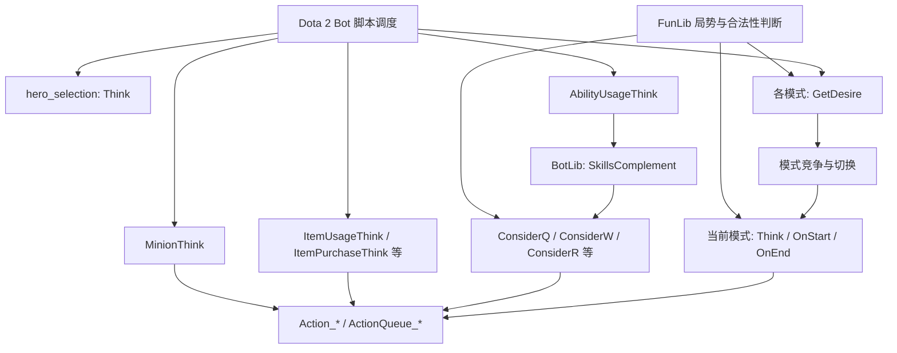
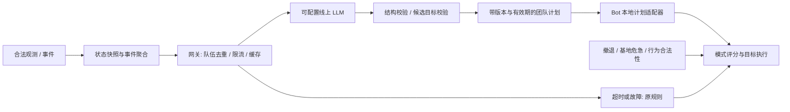

# Open Hyper AI：代码结构、决策机制与 LLM 增强设计

后续实施以[LLM 战略增强实施与审计计划](LLM_STRATEGY_IMPLEMENTATION_PLAN_ZH.md)为准；其中按用户要求进一步收窄了微操改动范围。

分析日期：2026-09-21。代码基线：`cb814c6c8dc51ed08045d6efd9f4a48147992711`。

本文依据当前目录的静态代码检查；没有启动 Dota 2、运行对局或调用项目的聊天服务。所有延迟、采样频率、阈值与实施阶段均为建议，尚未经对局验证。本文是说明与设计文件，未实现 LLM 决策功能。

补充设计：[决策结构、对线与位置分工，以及 LLM 介入点](ROLE_LANING_AND_LLM_DESIGN_ZH.md)，包含低频出装调整的购买事务设计。

## 1. 对最初猜想的确认

**猜想基本正确：引擎按约定的脚本文件名与回调函数名加载 Lua，由这些脚本参与 Bot 决策。** 但需要补充四点：

1. 项目是 **Lua 为主、部分 TypeScript 编译为 Lua**，而不是全部手写 Lua。当前工作树有 278 个 `.lua`、31 个 `.ts`（包括声明文件），`bots/BotLib` 有 128 个 `hero_*.lua`。文件数不等于已实测支持的英雄数；README 的“127 英雄”是项目声明。
2. **不是所有函数都由引擎按名字自动调用。** `GetDesire`、`Think` 等属于引擎回调；`SkillsComplement`、`ConsiderQ`、`J.GetTeamFightLocation` 属于项目自定义函数，由 Lua 代码显式调用。
3. 整体更像 **分层的规则系统＋效用评分（desire）＋模式状态切换**，技能部分常是有顺序的条件分支。用“决策树”作通俗描述可以，但它不是一个统一的树结构，也没有在当前作战链路中发现端到端神经网络推理或在线学习流程。
4. **仍依赖 Valve 默认 Bot 行为。** 项目覆盖部分模式、部分英雄的缺陷与技能行为，并未完全重写引擎中的 AI。

特别要纠正一个容易从文件名产生的误解：当前 [bot_generic.lua](../bots/bot_generic.lua) **没有定义英雄级 `Think()`**；它加载英雄模块并定义 `MinionThink`。不能把它理解为统管所有英雄行为的主循环。英雄模式和技能／物品回调分别运行。

## 2. 目录与构建关系

| 目录／文件 | 实际职责 | 后续开发注意事项 |
|---|---|---|
| `bots/hero_selection.lua` | 选人、角色／分路相关逻辑 | 选人阶段 `Think()` 与战斗模式 `Think()` 是不同上下文 |
| `bots/mode_*_generic.lua` | 对线、刷钱、推塔、防守、撤退、Roshan、插眼等 | 本次匹配到 20 个此命名形式文件；不能据此断言每个都被引擎识别 |
| `bots/ability_item_usage_generic.lua` | 技能、物品、升级、买活、信使回调 | 已超过 8,400 行，是关键维护热点 |
| `bots/item_purchase_generic.lua` | 购买清单、装备组件及购买流程 | 独立的 `ItemPurchaseThink()` |
| `bots/BotLib/hero_*.lua` | 英雄出装、加点、技能使用及部分召唤物逻辑 | 通常手写 Lua；`hero_wisp` 存在 TS 对应源文件，应逐文件核对 |
| `bots/FunLib` | 公共判断、地图、角色、推塔、防守、目标选择等 | `jmz_func.lua` 是 `J.*` 工具入口，不是集中式战略规划器 |
| `bots/FretBots*` | 增强难度、服务端事件、奖励、聊天等 | 需要额外启用；不要假设普通 Bot 环境具备相同权限 |
| `bots/Buff` | 另一套增益／中立物品相关机制 | 提高数值与提高决策能力是不同实验变量 |
| `bots/Customize` | 通用与英雄配置 | 已有聊天开关，但没有完整的战略模型配置 |
| `typescript/bots` | 部分 Bot 模块的 TS 源码 | 编辑 TS 后生成对应 Lua，不应只改生成文件 |
| `typescript/post-process` | 编译后路径处理和外部数据更新脚本 | 属于开发工具，不是游戏内 Node 服务 |
| `game` | 初始化／兼容代码与永久配置位置 | 不是当前已经存在的 LLM 后端 |

[package.json](../package.json) 的 `npm run build` 调用 TSTL 和路径后处理；[tsconfig-tstl.json](../tsconfig-tstl.json) 指定 Lua 5.1 目标。最终在游戏中执行的是 Lua，不是 Node.js 或 TypeScript。

[后处理脚本](../typescript/post-process/post-process-lua.js) 将部分 `bots.*` 导入转换成 `GetScriptDirectory()` 路径。现有 `npm run dev` 仅启动 TSTL watch，没有串联该后处理；新模块的导入必须检查最终 Lua，不能只看 TS 类型检查通过。

README 要求 Custom Lobby / Local Host；克隆目录本身不等于脚本已经装入游戏。此次没有核实本机安装状态。现有说明中的补丁版本是仓库维护者标注，不代表本次验证了当前客户端兼容性。

## 3. 实际决策调用关系

以下图表示逻辑依赖，**不承诺引擎回调的严格逐帧先后顺序**。



### 3.1 模式层：给行为打分，再执行当前模式

[mode_push_tower_mid_generic.lua](../bots/mode_push_tower_mid_generic.lua) 是很直接的例子：

```lua
function GetDesire()
    bot.PushLaneDesire[LANE_MID] = Push.GetPushDesire(bot, LANE_MID)
    return bot.PushLaneDesire[LANE_MID]
end
function Think() Push.PushThink(bot, LANE_MID) end
```

`GetPushDesire` 决定中路推塔的倾向，`PushThink` 执行具体行为。上／下路有类似包装。实际评分逻辑在 [aba_push.ts](../typescript/bots/FunLib/aba_push.ts)，综合存活人数、基地威胁、单位状态等，并包含多种提前返回条件。

[mode_attack_generic.lua](../bots/mode_attack_generic.lua) 只对 `BuggyHeroesDueToValveTooLazy` 中的英雄安装自定义攻击回调；其他英雄并没有在该文件获得同样覆盖。[mode_laning_generic.lua](../bots/mode_laning_generic.lua) 则组合自己的评分与特定英雄的替代逻辑。这说明“自定义规则与默认引擎逻辑共存”，不能假设每一层均可在此仓库中找到完整实现。

### 3.2 技能层：通常是优先级规则，不是全局最优搜索

[ability_item_usage_generic.lua](../bots/ability_item_usage_generic.lua) 中 `AbilityUsageThink()` 调用英雄模块的 `SkillsComplement()`。

例如 [hero_axe.lua](../bots/BotLib/hero_axe.lua) 依次检查 `ConsiderR` → `ConsiderQ` → `ConsiderW`，第一个有有效意愿的技能进入动作队列后直接返回。这不是先比较所有技能分数再选最大值，而是顺序优先规则。

项目已有节流：技能／物品回调根据 `bot.frameProcessTime` 与 `Customize.ThinkLess` 判断是否跳过；买活、信使和升级有不同检查间隔。因此“引擎可能频繁调用”与“每次都完整计算”也不等价。

### 3.3 现有团队判断有用，但不是持续计划

`J.GetTeamFightLocation()` 寻找符合条件的交战区域；`J.GetNumOfAliveHeroes()` 统计存活；推塔／防守／Roshan 各自利用这些信息。它们提供局部判断，但在已检查的链路中，没有发现通用的“团战结束 → 判定收益 → 选择后续目标 → 分配五人职责 → 持续执行和撤销”协议。

这正是适合增强的层次：**把当前局势判断转成可持续、可协调、可中断的团队计划。**

## 4. 当前已有的网络和事件基础

### 4.1 已有 AI 聊天，不等于 AI 决策

[FretBots/Chat.lua](../bots/FretBots/Chat.lua) 向固定地址 `https://chatgpt-with-dota2bot.onrender.com/` 请求聊天结果，最终 `HandleResponseMessage()` 调用 `Say()`。它不是施法、推塔或目标分配控制器。

`Customize.Allow_AI_GPT_Response` 和 `Allow_Trash_Talk` 是聊天相关开关。`Chat.lua` 中有空的 `API_KEY` 占位和固定 URL，但没有完整的可配置 provider、model、temperature、超时和战略输出校验。不能把此开关当作“LLM 指挥开关”。此次没有请求该远端，也没有确认其当前可用性、实现或实际模型。

### 4.2 普通 Bot 有 HTTP 封装，但仍是开发基础

[http_req.ts](../typescript/bots/ts_libs/utils/http_utils/http_req.ts) 使用 `CreateRemoteHTTPRequest`，默认地址是 `http://127.0.0.1:5000/`，接口类型中含 `uuid` 和 `gamestate`。需要留意：

- `HttpPost` 在 UUID 缺失时只调用 `GetUUID`，没有在该分支完成原请求重发。
- 当前检查未发现 `Request.UUID` 被成功赋值的调用链；`InitiStats` 回调只打印结果。
- `RawPostRequest` 直接 `JSON.decode(result)`，没有受保护解析、大小限制或明确的错误分类。
- 未见此链路具备战略响应校验、超时降级、断路器、队伍级去重等完整机制。
- `utils.ts` 的 `QueryCounters` 还标注了试验不工作；不能从封装存在推断网络已经实测可用。

当前目录没有发现对应 `/gamestate` 战略服务实现，也没有发现模型输出进入作战模式的完整闭环。

### 4.3 FretBots 已有可复用的死亡与建筑事件入口

[FretBots.lua](../bots/FretBots.lua) 初始化服务端扩展；[OnEntityKilled.lua](../bots/FretBots/OnEntityKilled.lua) 注册 `entity_killed`，处理英雄死亡，并将建筑死亡送给 [GameState.lua](../bots/FretBots/GameState.lua)。后者的现有用途主要是根据建筑状态调整奖励节流，而非通用宏观战略。

`OnEntityHurt.lua` 也注册伤害事件，可作为团战检测的输入。应在这些入口旁增加独立事件规范化模块，而不是让战略服务隐式依赖难度奖励是否打开。

### 4.4 两种脚本环境必须分开适配

| 能力 | 普通 Bot 脚本 | FretBots 服务端扩展 |
|---|---|---|
| 决策入口 | 模式和技能／物品回调 | 事件与计时器，再通过桥接送给 Bot |
| 本仓库 HTTP 用法 | `CreateRemoteHTTPRequest(url)` | `CreateHTTPRequest("POST", url)` |
| 死亡／拆塔检测 | 可用状态的轮询差分，具体 API 需实测 | 已存在 `ListenToGameEvent` |
| 队伍计划共享 | 不应假定不同 Bot／模式共享一个 Lua 全局表 | 也不能直接假定服务端全局可被 Bot 读取 |
| 信息权限 | 以己方可见与公开信息为准 | 可能获得更多全局状态，必须过滤 |

已有 API 文档对 HTTP 的描述不能跨环境直接套用。上线前必须验证目标客户端、Local Host、两类上下文的 HTTP 构造方式、回调格式、可达地址、暂停与重新开局行为。先做最小回显请求，再选传输实现。

## 5. 建议架构：LLM 负责低频团队目标，本地规则负责实时动作



推荐独立本地网关，负责提供商适配、密钥、预算、日志和队伍级状态。Lua 不放线上模型密钥，也不承担复杂 SSE／流式解析。网关与 Lua 的可达性尚待验证；本地 HTTP 不可用时才选择经实测可达的受控远端网关。

### 5.1 模型应选什么

第一版只覆盖：`push`、`defend`、`roshan`、`farm`、`reset`。模型输出目标、参与者和有效期，例如“1、3、4、5 号位集结中路推二塔，2 号位清边线，核心低血则撤销”。不要让它逐帧选择走位、补刀或技能时机。

更可靠的实现是由规则先生成 **合法候选计划**，每个候选附带可达性、所需人数、预计时间、风险和本地评分；LLM 返回 `candidate_id`。不可达目标、无兵线推塔、目标已消失等，应在候选生成阶段排除，而非期待模型自行避免。

模型建议先以 shadow（仅记录、不执行）方式运行，然后只给指定模式有限的评分偏置。不是所有建议都应接受；`no_change` 必须是合法结果。模型自报 confidence 不能视为校准后的胜率。

### 5.2 如何真正影响当前代码

建议新增 `strategy_state`、`strategy_events`、`strategy_client`、`strategy_policy` 等模块（这些文件当前不存在），TS 优先，编译输出到 `bots/FunLib`。

| 改动点 | 建议接入方式 |
|---|---|
| `aba_push.ts`、`aba_defend.ts` | 安全规则通过后读取有效计划，改变目标 lane 与有限的 desire 偏置 |
| `mode_roshan_generic.lua` | 仅在人数、DPS、位置、基地安全等前提满足时接受 Roshan 候选 |
| `mode_farm_generic.lua` | 按参与者分工分配安全区域，避免全部英雄挤同一资源点 |
| 模式 `Think`／`OnEnd` | 执行计划目标，切换时清理本计划发出的陈旧动作队列 |
| 已保证运行的回调／独立已验证调度入口 | 节流采样、异步请求及计划拉取；不能仅挂在某个偶尔激活模式的 `Think` |
| `FretBots/OnEntityKilled.lua` 等 | 可选精确事件适配器，与奖励逻辑分离 |
| `Customize` 与网关配置 | 提供独立战略开关；默认关闭 |

评分合成应类似：`hard_veto → 原始评分 → 有效计划的有限偏置 → 范围约束`。**不能简单把所有 `GetDesire` 的返回值最后加一个常数**：原来的 0 分可能是硬性禁止，必须保留原因。应先把关键分支整理成 `{allowed, score, reason}`。

只修改分数还不够：`Think()` 必须识别计划目标和参与者，否则会发生“提高推塔评分，执行时仍去另一座塔”。引擎仍负责模式仲裁，计划不直接越过本地安全条件。紧急撤退、躲技能、保护基地必须能立即中断战略计划。

### 5.3 一个队伍一个计划，解决重复调用与状态共享

不建议五名英雄分别请求同一个模型。推荐网关以 `(session_id, team_id)` 持有权威计划，以 `request_id`、`event_id` 去重；每队最多一个在途规划请求，其余重要变化合并成 pending 最新状态。

普通 Bot 环境可让各英雄低频上报自身合法观测，由网关融合；其他模块只读本地缓存。如果采用选举一个 Bot 负责请求，必须处理其死亡、退出、重载与领导租约切换。MVP 更适合网关去重，避免把跨 Lua scope 共享假设当作前提。

即使启用 FretBots，也要显式验证服务端到 Bot 的计划桥接。可先采用经过回显验证的 HTTP 拉取；不要把 `require` 的模块缓存或 `bot.someField` 当作跨全部上下文可靠的消息总线。双方都启用时严格分离队伍状态和观测。

## 6. 事件与时间触发设计

你提出的 5／10／20 分钟属于**定时触发**，团战、死亡、拆塔、Roshan 属于**事件触发**，建议两者结合。

| 触发 | 检测建议 | 去噪与用途 |
|---|---|---|
| 5／10／20 分钟 | 比较 `previous_time < threshold <= current_time` | 按 session＋阈值只触发一次，不用浮点相等；Turbo 单独配置 |
| 英雄死亡／复活 | FretBots 事件或存活状态差分 | 同一波死亡合并；己方核心死亡立刻本地失效旧计划 |
| 团战结束 | 区域聚类的近期伤害、参战人数、死亡与持续脱战窗口 | 不是单个引擎“赢团”事件；先产生摘要，再评估结果 |
| 拆塔／丢塔／兵营变化 | 建筑事件或已知建筑存活差分 | 核对阵营、建筑标识；反补也属于建筑消失而非英雄击杀收益 |
| Roshan 死亡 | 可用死亡事件或 `GetRoshanKillTime()` 的变化 | 死亡信息不自动证明击杀归属和盾归属 |
| 不朽盾获得／消失 | 己方物品／状态变化；敌方只用合法可见或公开证据 | 持有者、获取时间、死亡消耗、到期分开；未知不能填“无盾” |
| 关键装备／大招就绪 | 己方状态阈值变化 | 适合作为第二阶段扩展，避免第一版请求过密 |
| 计划到期／局势剧变 | TTL、目标消失、参战者死亡、基地告急 | 本地立即撤销；LLM 后续重新规划 |

建议起点：观测采样 0.5–1 秒；一般事件聚合 2–5 秒；常规 LLM 请求最小间隔 20–30 秒；定时战略复核可每 60–120 秒一次，另保留显式阶段节点。它们是待调参数，不是已测最优值。

### 团战结果不能只看人头

可从“同一区域双方至少各 2 名英雄参与＋发生伤害”建立候选战斗；连续 6–10 秒脱战再关闭，聚合期间的死亡、买活、核心状态、资源消耗与附近目标。跨地图同时发生的零星击杀不要合并为一波团战。

输出 `favorable / unfavorable / mixed / uncertain` 比强行二分胜负更合理。敌方多人死亡但己方低血、无兵线、关键技能全冷却，不一定适合上高。相反，有安全兵线时可先取塔，而不是惯性打盾。

现有 `J.IsRoshanAlive()` 主要依据击杀时间和固定等待阈值推断，不是实时可见性证明。新快照应保留 `confirmed_alive / confirmed_dead / respawn_possible / unknown`，并附证据时间，而不是直接复制布尔值当绝对事实。

## 7. 输入、输出和自定义配置契约

### 7.1 输入快照

至少包含：协议版本、session／team／request ID、游戏模式、补丁标识、游戏时间、观测版本、触发原因、己方状态、敌方最后可见状态、建筑／兵线、Roshan／盾证据、当前计划和合法候选。

每条敌方观测应有 `observed_at`、`last_seen_age`、`source`；未知血量／装备／位置写 `null` 或显式 `unknown`，不能当作 0。敌方隐藏经济、技能冷却与位置不能通过 FretBots 的全局权限偷偷补齐。研究用全知模式若存在，必须单列，不能与公平模式比较战绩。

只发送决策所需信息，不需要玩家账号或聊天记录。角色使用局内 ID。不要把聊天中的自由文本拼进高优先级模型指令。

### 7.2 输出示例（建议协议，尚未实现）

```json
{
  "schema_version": 1,
  "session_id": "local-match-001",
  "team_id": 2,
  "request_id": "r-104",
  "state_version": 381,
  "plan_version": 12,
  "candidate_id": "push_mid_t2_group_a",
  "issued_game_time": 1210.0,
  "expires_game_time": 1230.0,
  "reason_code": "enemy_cores_dead"
}
```

候选计划由本地／网关确定具体参与者、合法目标和中止条件。版本、时间戳和身份字段应由网关绑定原请求生成／核对，不能信任模型随意填写。游戏端应用前再次检查目标存在、可行动成员、资源、TTL 与关键状态变化。

响应必须通过 JSON 解析、字段白名单、类型／枚举校验、会话和队伍匹配、请求新旧判断、长度限制。拒绝 Lua 代码、自由函数名和未经验证的坐标指令；绝不 `loadstring` 执行模型输出。

### 7.3 配置示例（网关端，尚未实现）

```json
{
  "enabled": false,
  "mode": "shadow",
  "provider": {
    "adapter": "chat_completions_compatible",
    "base_url": "https://your-provider.example/v1",
    "model": "your-model-id",
    "api_key_env": "DOTA_STRATEGY_API_KEY",
    "request_timeout_ms": 4000,
    "generation": {
      "temperature": 0.2,
      "top_p": 1.0,
      "max_tokens": 600
    },
    "extra_body": {}
  },
  "strategy": {
    "milestones_seconds": [300, 600, 1200],
    "min_request_interval_seconds": 25,
    "event_debounce_seconds": 3,
    "max_inflight_per_team": 1,
    "max_plan_age_seconds": 20,
    "max_requests_per_match_per_team": 120,
    "max_total_tokens_per_match_per_team": 150000,
    "fallback": "existing_rules"
  }
}
```

这是项目自定义配置设计，不表示仓库现已支持，也不保证任意提供商接受所有参数。`adapter` 负责 URL 拼接、鉴权头、消息格式和参数转换；不支持的字段应配置时报错。部分模型使用不同的 token 上限参数或不接受 temperature，应由适配器处理。`extra_body` 仅允许经过适配器白名单验证的字段，不能覆盖地址、密钥、身份或限流策略。

Lua 侧只需网关地址、战略开关、运行模式和非敏感节流参数；长期模型密钥保留在网关环境变量。用户自定义地址与模型参数由配置文件提供，不要求改代码。配置需支持启动校验、脱敏打印和热更新版本；换模型时清理不兼容的缓存。

## 8. 延迟、失败和计划稳定性

- **异步请求，绝不等待模型后才行动。** 请求在途时继续原规则或仍有效的旧计划。
- **双重有效期。** 网关以真实时间控制网络超时，Bot 以游戏时间判断计划 TTL；暂停和恢复后重新验证快照，防止暂停期间返回的旧计划被误用。
- **乱序处理。** 新事件使旧请求失效；迟到回调不得覆盖较新的计划。若无法取消网络请求，也要逻辑丢弃结果。
- **软承诺＋硬中止。** 普通计划可设 5–10 秒最小保持期来减少左右横跳，但核心死亡、基地危险、目标消失立即中断。
- **过期只针对相关变化。** 不必因为每次采样都递增了版本就拒绝所有响应；用快照年龄＋关键状态签名＋最新请求代数判断。
- **有限重试和断路。** 429／超时／不可用时退避，超过阈值暂时关模型；达到请求或 token 预算也回退原规则。
- **故障封闭到原有行为。** 非法 JSON、无效候选、错误队伍、未知目标一律不执行。回退不能等同于所有 desire 归零或让 Bot 停住。
- **先测端到端延迟。** 示例 4 秒超时、20 秒 TTL 只是起点；需记录 p50／p95、过期拒绝率与计划实际执行比例。

一队运行 40 分钟、平均每 25 秒调用一次约 96 次；双方约 192 次，不含额外机制。真实费用用提供商账单与输入／输出 token 统计计算，不能仅按请求数判断。计划拉取和状态上传不应每次都触发 LLM。

## 9. 不接 LLM 也值得优先做的提升

| 优先级 | 提升 | 原因与验证指标 |
|---|---|---|
| P0 | 决策可观测性：记录评分、否决原因、目标、切换、动作 | 先定位“为何赢团后刷野”；记录每分钟切换次数与目标完成率 |
| P0 | 补齐 API／空值与状态生命周期防护 | 如 `bot_generic.lua` 在判 nil 前调用 `GetUnitName()`；这是静态风险，未证明当前运行会触发 |
| P1 | 统一团队候选与职责分配 | 同一份计划避免辅助抢安全资源、核心单人送塔；规则本身也可选候选 |
| P1 | 目标保持与撤销机制 | 减少往返走动、重复集结；观察无效行走、承诺中断原因 |
| P1 | 收益窗口计算 | 敌方复活时间、兵线到达、己方到场、打盾／拆塔时间共同决定可行性 |
| P1 | 视野与风险建模 | 用敌方最后出现位置和失联时间表达不确定性；降低无视野死亡 |
| P2 | 英雄协同与战术规则 | 先手／反手、关键大招与 BKB 冷却、控制重叠、目标集火 |
| P2 | 出装策略改进 | 根据敌方伤害／控制／治疗调整有限候选装备，避免任意改清单破坏购买流程 |
| P3 | 离线学习与规则提炼 | 从录像、日志和强方案提炼稳定规则；减少运行时成本 |

LLM 的价值主要是跨目标权衡与事件后的计划重整，不会自动修复错误地图常量、能力识别、走位或施法 API。接入战略模型也不等同于复现 OpenAI Five 那类训练系统。

## 10. 推荐实施顺序与验收

### 阶段 A：运行能力探针和规则基线

确认安装模式，验证两类 Lua 环境的 HTTP、回调、游戏时间、暂停、重开局、死亡期间回调、队伍隔离与计划桥接。建立合法状态采样、事件日志及不接模型的候选评分。没有这一步，不应直接写“LLM 已可接入所有事件”。

### 阶段 B：只观察的 LLM MVP

实现网关、自定义地址／模型／参数、JSON 校验和预算。先支持 5／10／20 分钟、英雄死亡合并、建筑变化；团战结果、Roshan 归属与盾状态分开逐步补齐。记录原规则选项与模型建议，不改变动作。

### 阶段 C：有限战略执行

先接推塔／防守两类候选，确认评分与 `Think` 目标一致，再接 Roshan 和 farm。每队一个计划；通过当前状态检查与 TTL 后才执行；默认开关仍关闭，可一键恢复原规则。

### 阶段 D：成对对局与消融验证

至少比较三组：原版规则、规则团队规划器、同一规划器＋LLM。使用相同阵容／角色／难度与增益配置，交换天辉夜魇，尽量固定随机条件，覆盖顺风／逆风、不同英雄组合与不同游戏模式。固定条件仍不能保证 Dota 引擎完全确定性，应重复多局并报告样本量与不确定性。

重点指标：胜率及区间、团战后 30／60 秒目标转化率、计划执行成功率、无意义死亡、模式切换频率、行走浪费、HTTP／模型延迟、非法或过期输出比例、token／费用与帧时间开销。影子模式的“建议看起来合理”不构成胜率提升证据。

应覆盖的故障用例：网络断开、返回慢、乱序响应、非法 JSON、错误 session／team、目标已摧毁、己方核心死亡、计划领导者消失、暂停再恢复、重开局与预算耗尽。通过标准首先是原有 Bot 持续正常行动、无跨队信息泄漏和无陈旧计划执行。

当前 `package.json` 没有测试命令，检查范围内未发现专门自动化测试目录。后续纯状态／事件聚合／协议校验适合离线测试；引擎 API、共享 scope、实际动作和对局效果必须游戏内验证。

## 11. 证据与边界

主要依据均为当前工作树：

- 加载与模块关系：[bot_generic.lua](../bots/bot_generic.lua)、[hero_selection.lua](../bots/hero_selection.lua)、[ability_item_usage_generic.lua](../bots/ability_item_usage_generic.lua)。
- 模式评分与动作：[中路推塔](../bots/mode_push_tower_mid_generic.lua)、[推塔 TS 源码](../typescript/bots/FunLib/aba_push.ts)、[Roshan 模式](../bots/mode_roshan_generic.lua)、[斧王技能](../bots/BotLib/hero_axe.lua)。
- 网络与事件：[HTTP TS 封装](../typescript/bots/ts_libs/utils/http_utils/http_req.ts)、[聊天](../bots/FretBots/Chat.lua)、[死亡事件](../bots/FretBots/OnEntityKilled.lua)、[建筑状态](../bots/FretBots/GameState.lua)。
- 项目说明：[README](../README.md)、[架构文档](ARCHITECTURE.md)、[API 参考](BOT_API_REFERENCE.md)、[TS 说明](../typescript/README.md)。现有文档的“所有英雄模块都是纯 Lua”等概括，应以实际 TS 对应文件为准。

外部核验尝试访问 [Valve Bot Scripting](https://developer.valvesoftware.com/wiki/Dota_Bot_Scripting) 和 [ListenToGameEvent API](https://developer.valvesoftware.com/wiki/Dota_2_Workshop_Tools/Scripting/API/Global.ListenToGameEvent)，本次访问被 403／访问限制阻止。因此没有将其当作已读取的最新 API 证据，也没有用社区转载替代客户端实测。

本次完成的是入口、代表性模式／英雄、团队工具、事件及网络通路的架构级审阅，不是逐行审计全部 128 个英雄，也没有测得胜率、响应延迟或当前补丁兼容性。
